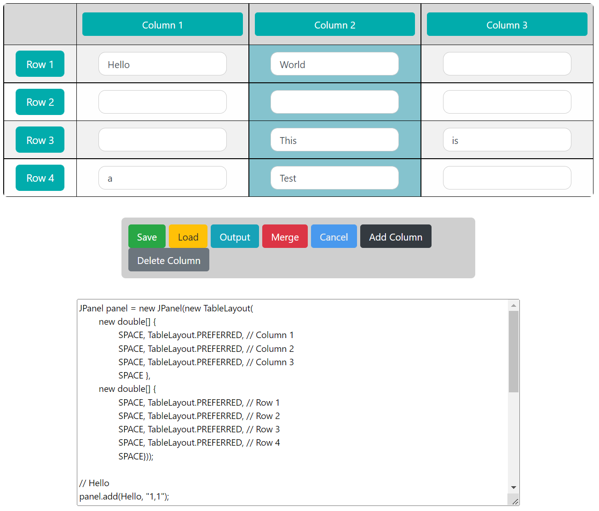

# Swing Table Layout Utility

Oracle has a layout manager called TableLayout which is an alternative for GridBagLayout for Java Swing. Essentially, to create a layout in Swing, you need to initialize the panel with appropriate and respective dimensions. This can be a major hassle especially if the layout is complex or tedious.

This simple and straightforward web-based utility helper gives the users the capability to "draw" their table and generate the strings for the TableLayout that they can copy and paste to their program. It also support cell merging and save/load via JSON. The textform on each cell is to designate a placeholder for the actual JComponent in Swing.